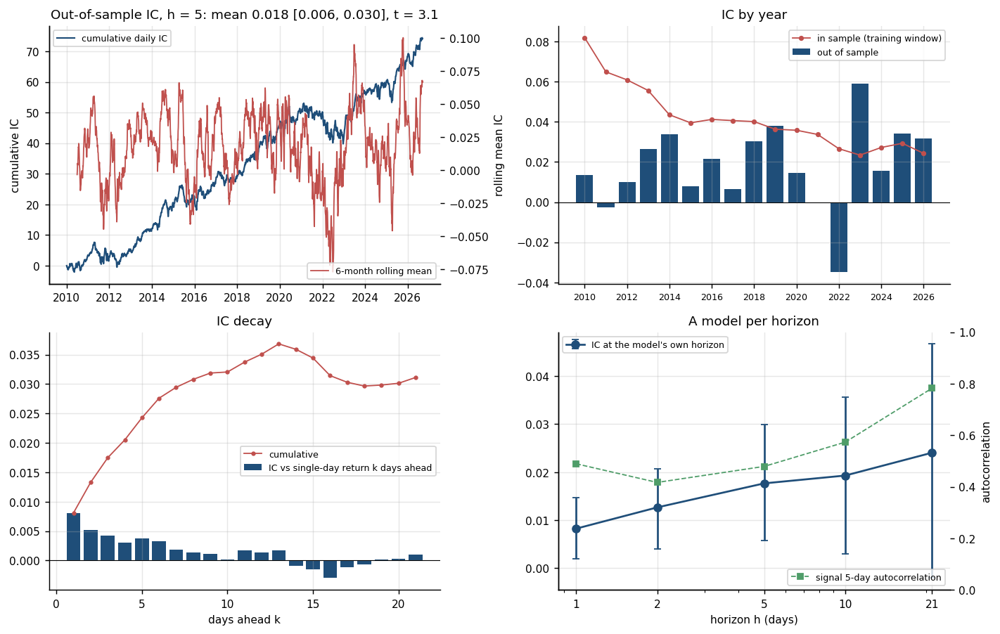
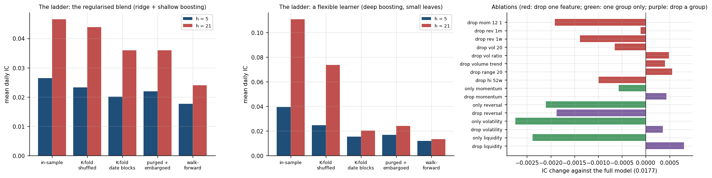
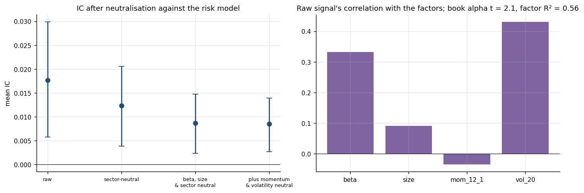
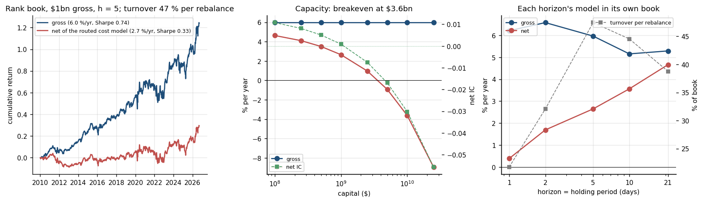
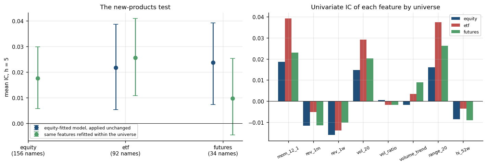

# xs-signal-research — cross-sectional ML signal research on equities, ETFs and index futures

**Question.** The algo-wheel project built an ordinary machine-learning equity signal in order to study what execution costs do to it. Here the signal itself is the object: how much of its information coefficient is real once validation is honest, which features carry it, how fast it decays, what a simple risk model leaves of it, what the algo-wheel's own cost model leaves of it at a stated capital, and whether the same feature set, fitted on equities, says anything about ETFs and futures.

**Answer (§Results).**

- *The signal.* Out of sample over 2010–2026 (4,197 days, 156 names) the 5-day IC is **0.0177 [0.0058, 0.0299]** (moving-block bootstrap; Newey–West t = 3.1), decile 10 minus decile 1 is 34 bp per five days, and the in-sample IC of the training windows runs from 0.082 down to 0.024: the honest number is between a quarter and three quarters of what the fit reports. The information arrives early — IC 0.0081 against the next day's return, 0.0038 against the fifth, 0.0002 against the tenth — and the signal itself half-decays in 4.7 days, so a 21-day model has the highest IC (0.024) and the lowest information ratio (0.39 against 0.68 at two days).
- *Honest validation.* For this regularised learner the leak is small: shuffled K-fold reports 0.023, purged and embargoed K-fold 0.022, walk-forward 0.018. Give the same data to a learner flexible enough to memorise (boosting, depth 6, 20 rows per leaf) and shuffled K-fold reports 0.074 at 21 days against 0.024 purged and 0.013 walk-forward: **three times the honest number**, entirely from the test days' overlapping neighbours sitting in training.
- *Ablations.* No feature is essential: dropping any one moves the IC by at most 0.002 (only 12-1 momentum reaches |t| = 2), and each of the four groups alone recovers 0.015–0.017 of the 0.0177. The features are substitutes for one bet, not eight bets.
- *The risk model.* That bet is largely beta and volatility: the raw signal correlates +0.33 with beta and +0.43 with 20-day volatility, the gross rank book has a factor R² of 0.56 (loading 0.73 on volatility, 0.40 on size), and neutralising beta, size and sector leaves **0.0086 [0.0024, 0.0147]**; neutralising momentum and volatility as well leaves 0.0085. Half the IC is a factor tilt a risk model prices; the other half survives it, with t = 2.8.
- *Costs.* At $1bn the rank book earns 5.96 % a year gross (Sharpe 0.74) and **2.65 % net** of the routed cost model (Sharpe 0.33) at 47 % turnover per five-day rebalance and 6.7 bp per one-way trade; 1.67 % under the observed-cost fit. Breakeven capital is $3.6bn. Per name, the **net IC** — the signal against the return each name earns after paying its own trading cost — is 0.0108 at $100m and **0.0009 [−0.011, 0.013] at $1bn**: at that size the ranking pays for itself and nothing more, and the book's 2.65 % comes from the large positions the equal-weighted IC does not favour. Holding longer helps more than it hurts (net 4.7 % at 21 days, Sharpe 0.57, against 0.4 % at one day); the neutralised books do not pay (0.2 % and −0.7 % net). The deflated Sharpe of the net book over the 41 configurations run here is 0.16.
- *New products.* The equity-fitted models of each year, applied unchanged, give an IC of **0.0218 [0.0054, 0.0387]** on 92 ETFs (t = 2.7) and **0.0238 [0.0073, 0.0392]** on 34 futures (t = 3.1) — as much as on the equities they were fitted to. Refitting within the universe helps ETFs (0.0256) and hurts futures (0.0098, t = 1.4: 34 names are too few to fit). Six of the eight features keep their univariate sign across all three universes; volume trend flips. On ETFs the transfer is a bond and international story (bonds 0.041, t = 3.2) and the model is wrong on commodities (−0.032, t = −2.6); on US sector, style and broad ETFs it is nothing. The futures book nets 6.3 % a year at half a tick plus commission; the ETF book loses money at $1bn because the impact term sees the small funds' ADV.

Python package `xsig`: the algo-wheel's features and learner unchanged, purged K-fold against the leaky alternatives, Newey–West and block-bootstrap inference, IC decay and half-life, ablations, a four-factor-plus-sector risk model with Fama–MacBeth attribution, the algo-wheel cost model on a rank book with a capacity curve, a deflated Sharpe, the transfer test, DuckDB over every table. 17 tests, CI, `notebooks/results.ipynb`, `report.pdf`.

---

## Layout

| path | what |
|---|---|
| `xsig/data.py` | the three universes (committed parquet), wide panels, dollar ADV, volatility, the spread rule, futures tick and notional, a DuckDB store over every parquet |
| `xsig/features.py` | the eight algo-wheel features rank-normalised per day; forward returns at 1, 2, 5, 10, 21 days demeaned across the eligible universe |
| `xsig/models.py` | ridge + gradient-boosting blend, z-scored per day; walk-forward refit each January with an embargo of h + 5 days; the fitted models of each year kept for the transfer test |
| `xsig/cv.py` | purged and embargoed K-fold, the leaky alternatives (shuffled rows, date blocks without purge, in-sample), and the validation ladder |
| `xsig/metrics.py` | daily Spearman IC, Newey–West t, moving-block bootstrap, IC decay, signal autocorrelation and half-life, decile spreads, deflated Sharpe |
| `xsig/risk.py` | beta, size and sector exposures plus the two style factors; neutralisation by daily cross-sectional regression; Fama–MacBeth factor returns; time-series attribution |
| `xsig/costs.py` | the algo-wheel's pre-trade cost model with its two fitted parameter sets; the futures variant (half a tick plus commission) |
| `xsig/portfolio.py` | rank-weighted dollar-neutral book with drift, rebalanced every h days, costed per name at the order's share of ADV; capacity curve, breakeven capital, the net IC |
| `xsig/transfer.py` | the equity models applied unchanged to ETFs and futures, the same learner refitted within each universe, univariate IC per feature per universe |
| `xsig/run.py` | `python -m xsig signal \| validate \| ablate \| neutralise \| costs \| transfer \| all [--quick]`, `python -m xsig sql "..."` → `results/*.json` |
| `configs/pipeline.json` | years, horizons, learner, book, capital grid, bootstrap size, the quick (CI) configuration |
| `tests/`, `.github/workflows/ci.yml` | 17 tests (no look-ahead, rank transform, purged splits, the synthetic leak, Newey–West, bootstrap coverage, neutralisation, Fama–MacBeth recovery, cost model, book accounting, one end-to-end pass on the committed data); CI runs them and the quick pipeline with every downstream script |
| `scripts/run_all.sh`, `plots.py`, `summarize.py`, `report.py`, `make_notebook.py` | pipeline, figures, `results/summary.md`, `report.pdf`, the executed `notebooks/results.ipynb`; `tools/download.py` refreshes the ETF and futures bars |

Run: `pip install -e .[test]`, then `scripts/run_all.sh` (about an hour: some 60 walk-forward fits over 17 years, two validation ladders with a flexible learner, 2,000 block bootstraps) or `python -m xsig all --quick` (2019–2026, a smaller learner, about ten minutes: the CI configuration).

---

## Data

| layer | source | notes |
|---|---|---|
| equities | the algo-wheel panel: Yahoo daily bars for 156 US large caps, 2006-09 to 2026-09 (`data/derived/equity.parquet`) | today's large caps, so every gross number carries survivorship bias; a name-day is eligible when its 20-day dollar ADV is at least $50m |
| ETFs | Yahoo daily bars for 92 ETFs: US broad, sector, style, international, bond, commodity, currency (`data/derived/etf.parquet`, `data/universe_etf.csv`) | unbalanced panel, funds enter when listed; eligible above $5m ADV |
| futures | Yahoo continuous front-month series for 34 CME and ICE contracts: equity index, rates, energy, metals, agriculturals, FX (`data/derived/futures.parquet`, `data/universe_futures.csv` with tick and multiplier) | unadjusted at rolls, so roll gaps sit in the returns; the contract volumes Yahoo reports are not reliable, so the futures cost model has no impact term |
| the signal | computed here, the algo-wheel's features and learner unchanged | features use data to the close of day t; the target starts at that close |
| costs | the algo-wheel's fitted pre-trade model (ProjectF `results/models.json`, `results/pretrade.json`) | two parameter sets, both stated below; fitted on a simulated market at the published scale of Almgren et al. (2005), so the net numbers are only as good as that model |

Nothing here is simulated except the cost of trading.

---

## Method

**Features and target.** Eight price-and-volume features per name and day — 12-1 momentum, 1-month and 1-week reversal, 20-day volatility, the 20/120-day volatility ratio, the 5/60-day volume trend, the 20-day log range, distance from the 52-week high — each Gaussian-rank-normalised across the eligible universe every day, $x_i = \Phi^{-1}\big((\mathrm{rank}_i - \tfrac12)/N\big)$. The target at horizon $h$ is the forward return demeaned across the day, $y_{i,t}^{(h)} = r_{i,t\to t+h} - \bar r_{t\to t+h}$.

**Learner.** Ridge ($\alpha = 10$) and histogram gradient boosting (150 trees, depth 3, 200 rows per leaf), each prediction z-scored across the day and the two averaged: $z_i = \tfrac12 \tilde p^{\,\mathrm{ridge}}_i + \tfrac12 \tilde p^{\,\mathrm{gbm}}_i$. Walk-forward: the model for year $Y$ is fitted on every row with date $\le$ 1 January $Y$ minus $h + 5$ business days, so no training target overlaps a test date.

**Inference.** The IC on day $t$ is the Spearman correlation between $z_{\cdot,t}$ and $y_{\cdot,t}^{(h)}$. Consecutive ICs share $h-1$ days of target, so the mean carries a Bartlett-kernel (Newey–West) variance at lag $h$,

$$\widehat{\mathrm{Var}}(\bar{\mathrm{IC}}) = \frac{1}{T}\Big[\hat\gamma_0 + 2\sum_{k=1}^{h}\big(1 - \tfrac{k}{h+1}\big)\hat\gamma_k\Big],$$

and a moving-block-bootstrap interval with blocks of $2h+1$ days (Künsch 1989). The annualised information ratio is $\bar{\mathrm{IC}}/\sigma_{\mathrm{IC}}\sqrt{252/h}$. The IC decay is the correlation between $z_{\cdot,t}$ and the single-day demeaned return on day $t+k$; the signal's own persistence is the rank autocorrelation $\rho_k$ of $z$ at lag $k$, with half-life $\ln 2 / (-\ln \rho_1)$.

**The validation ladder.** The same learner is scored five ways on the same years: fitted on everything and scored in sample; 5-fold with shuffled rows (a test day's other names and its overlapping neighbours sit in training); 5-fold in contiguous date blocks without purging (only the $h$ days at each boundary leak); purged and embargoed 5-fold (López de Prado 2018, ch. 7: every training date within $h + 5$ days of the test block on either side is dropped); and walk-forward. A second ladder uses a learner flexible enough to memorise (boosting with depth 6, 20 rows per leaf, 300 trees), which is where the leak shows. The test suite has a synthetic version: overlapping sums of pure noise as the target, a persistent per-name random walk and calendar time as features — shuffled K-fold reports an IC above 0.2, purged K-fold reports none.

**Ablations.** Drop one feature, keep one group (momentum, reversal, volatility, liquidity), drop one group; the change in IC against the full model is a daily difference with its own Newey–West t. Each feature alone through ridge gives the univariate view.

**Risk model and neutralisation.** Exposures per name-day: $\beta$ (250-day, to the equal-weighted eligible universe), size (rank of log dollar ADV), sector dummies, and two style factors that are also the signal's inputs, 12-1 momentum and 20-day volatility. The neutralised signal is the residual of the daily cross-sectional regression $z = X_t b_t + \varepsilon$, z-scored; a book built from it has zero exposure to every column of $X_t$. Factor returns $f_t$ come from the same regression with $y^{(h)}$ on the left (Fama–MacBeth 1973), and the gross rank book's period returns are regressed on them: $R_t = a + \lambda^\top f_t + e_t$, reporting $a$, its $t$ and the $R^2$.

**Book, costs, capacity.** Weights are proportional to the demeaned signal, dollar-neutral, $\sum_i |w_i| = 1$, $|w_i| \le 2\,\%$, rebalanced every $h$ days after drifting the old book with realised returns. A rebalance in name $i$ trades $|\Delta w_i|\,C$ dollars, which is $q_i = |\Delta w_i|\,C/\mathrm{ADV\$}_i$ of its ADV, and pays the algo-wheel model

$$c_i = a + b\,\sigma_{i,\mathrm{bp}}\,\sqrt{q_i} + c\,s_{i,\mathrm{bp}}\quad\text{bp, one way},$$

with $(a, b, c) = (0.863, 0.201, 0)$ for the *routed* reduced form (orders sent to the wheel's best broker) and $(-1.14, 0.257, 0.79)$ for the *observed* fit; $\sigma$ is the 20-day daily volatility and $s$ the quoted spread from the ADV rule. Futures pay half a tick plus $2 a contract. Net return per period is $\sum_i w_i y_i - 10^{-4}\sum_i c_i |\Delta w_i|$; the capacity curve repeats the book across $C \in [\$0.1\text{bn}, \$25\text{bn}]$ and the breakeven capital is where the net annual return crosses zero. The **net IC** is the Spearman correlation, per rebalance, between the signal and the return net of the cost the signal's own trade in that name incurs, $y_i - \mathrm{sign}(w_i)\,10^{-4} c_i\,|\Delta w_i|/|w_i|$: what a follower of the signal earns per name after paying to hold it. Statistics are averaged over the $h$ possible rebalance offsets. The deflated Sharpe ratio (Bailey and López de Prado 2014) of the net book is computed against the expected maximum of $N$ null Sharpes, $N$ the number of configurations run in this repository (horizons, ablations, neutralisations, cost models).

**The new-products test.** For each year the equity-fitted models are applied unchanged to the ETF and futures frames of that year (features rank-normalised within each universe, so the inputs have the same distribution); the same learner is also refitted walk-forward within each universe; and each feature's univariate IC is tabulated per universe. ETF results are broken out by group.

---

---

## Results

Figures from `scripts/plots.py`; every table in `results/summary.md`; the run in `report.pdf`. Horizon 5 days unless stated; out-of-sample years 2010–2026; 613,034 name-days.

### The signal

| | IC | band | t (NW) | IR | days |
|---|---|---|---|---|---|
| ridge + boosting blend | 0.0177 | [0.0058, 0.0299] | 3.1 | 0.60 | 4,197 |
| ridge alone | 0.0182 | | 3.1 | | |
| boosting alone | 0.0150 | | 3.0 | | |

Positive on 53 % of days; negative years 2011, 2021 and 2022 (−0.035); best year 2023 (0.059). The in-sample IC of the training window falls from 0.082 (fitted to 2009) to 0.024 (fitted to 2025) as the crisis years become a smaller share of the sample; the realised IC does not fall with it. Rank autocorrelation of the signal: 0.86 at one day, 0.48 at five, 0.39 at twenty-one.

A model per horizon, each scored at its own horizon and at the others (rows are models, columns targets):

| model h | IC at own h | band | t | IR | vs 1d | vs 5d | vs 21d |
|---|---|---|---|---|---|---|---|
| 1 | 0.0082 | [0.0019, 0.0147] | 2.5 | 0.61 | 0.0082 | 0.0179 | 0.0237 |
| 2 | 0.0127 | [0.0041, 0.0207] | 3.1 | 0.68 | 0.0083 | 0.0180 | 0.0227 |
| 5 | 0.0177 | [0.0058, 0.0299] | 3.1 | 0.60 | 0.0081 | 0.0177 | 0.0235 |
| 10 | 0.0193 | [0.0029, 0.0357] | 2.5 | 0.47 | 0.0073 | 0.0175 | 0.0234 |
| 21 | 0.0241 | [−0.0021, 0.0467] | 2.1 | 0.39 | 0.0046 | 0.0154 | 0.0241 |

The five models rank names almost identically (the 1-day model scores 0.0237 against the 21-day target, the 21-day model 0.0241); the target horizon changes the fit's noise more than its content.

### Honest validation

| scheme | blend, h = 5 | blend, h = 21 | flexible boosting, h = 5 | flexible boosting, h = 21 |
|---|---|---|---|---|
| in-sample fit | 0.0264 | 0.0465 | 0.0395 | 0.1108 |
| 5-fold, shuffled rows | 0.0232 | 0.0438 | 0.0248 | 0.0737 |
| 5-fold, date blocks, no purge | 0.0201 | 0.0359 | 0.0155 | 0.0204 |
| 5-fold, purged and embargoed | 0.0220 | 0.0359 | 0.0168 | 0.0240 |
| walk-forward | 0.0177 | 0.0241 | 0.0120 | 0.0133 |

Purged K-fold sits above walk-forward because it also trains on later years; the two agree on the flexible learner's verdict — it is worse than the regularised one out of sample and much better in sample, which is what a leak looks like. Blocked K-fold without purging leaks only at the fold boundaries and is close to purged; the damage is in shuffling.

Ablations, walk-forward, difference against the full model with its own Newey–West t:

| variant | IC | Δ vs full | t(Δ) | | variant | IC | Δ vs full | t(Δ) |
|---|---|---|---|---|---|---|---|---|
| drop mom_12_1 | 0.0158 | −0.0019 | −2.1 | | only momentum | 0.0171 | −0.0006 | −0.2 |
| drop rev_1m | 0.0176 | −0.0001 | −0.2 | | only reversal | 0.0156 | −0.0021 | −0.4 |
| drop rev_1w | 0.0163 | −0.0014 | −0.6 | | only volatility | 0.0149 | −0.0027 | −0.6 |
| drop vol_20 | 0.0170 | −0.0007 | −0.9 | | only liquidity | 0.0153 | −0.0024 | −0.5 |
| drop vol_ratio | 0.0182 | +0.0005 | 0.8 | | drop momentum | 0.0181 | +0.0004 | 0.3 |
| drop volume_trend | 0.0181 | +0.0004 | 1.0 | | drop reversal | 0.0158 | −0.0019 | −0.8 |
| drop range_20 | 0.0182 | +0.0006 | 0.6 | | drop volatility | 0.0180 | +0.0004 | 0.5 |
| drop hi_52w | 0.0167 | −0.0010 | −0.7 | | drop liquidity | 0.0185 | +0.0008 | 0.9 |

Each feature alone through ridge: one-week reversal 0.0159 (t = 3.4), 20-day range 0.0161, 20-day volatility 0.0147, one-month reversal 0.0116, 52-week high 0.0085; 12-1 momentum −0.0057, because a linear fit on data to 2009 carries the 2009 momentum crash for years, while the feature's own univariate IC over 2010–2026 is +0.0187.

### The risk model

| signal | IC | band | t | decile spread, bp / 5d |
|---|---|---|---|---|
| raw | 0.0177 | [0.0058, 0.0299] | 3.1 | 34 |
| sector-neutral | 0.0123 | [0.0038, 0.0206] | 3.0 | 31 |
| beta, size and sector neutral | 0.0086 | [0.0024, 0.0147] | 2.8 | 24 |
| plus momentum and volatility neutral | 0.0085 | [0.0027, 0.0139] | 3.0 | 19 |

Fama–MacBeth premia over the period: beta 4.4 % a year (Sharpe 0.10), 20-day volatility 2.9 % (0.26), size −2.0 %, momentum 1.9 %. The gross rank book regressed on them: R² 0.56, loadings 0.73 on volatility, 0.40 on size, 0.25 on beta, alpha 5.3 bp per five days (t = 2.1). The learner has learned that high-volatility, high-beta names outperformed in the demeaned cross-section of a rising market; what is left after a risk model prices that is half the IC and a quarter of the book's variance.

### Costs and capacity

Rank book, $1bn, dollar-neutral, 2 % per name, rebalanced every five days, statistics averaged over the five rebalance offsets:

| cost model | gross % / yr | net | cost | Sharpe gross | Sharpe net | turnover per rebalance | bp per one-way trade | max drawdown net | net IC |
|---|---|---|---|---|---|---|---|---|---|
| routed (a 0.86, b 0.20) | 5.96 | 2.65 | 3.31 | 0.74 | 0.33 | 47 % | 6.7 | −15 % | 0.0009 [−0.0111, 0.0130] |
| observed (a −1.14, b 0.26, c 0.79) | 5.96 | 1.67 | 4.30 | 0.74 | 0.20 | 47 % | 8.7 | −18 % | −0.0043 [−0.0163, 0.0078] |

| capital | $0.1bn | $0.25bn | $0.5bn | $1bn | $2.5bn | $5bn | $10bn | $25bn |
|---|---|---|---|---|---|---|---|---|
| net % / yr | 4.63 | 4.10 | 3.50 | 2.65 | 0.96 | −0.94 | −3.62 | −8.96 |
| Sharpe net | 0.57 | 0.51 | 0.43 | 0.33 | 0.12 | −0.12 | −0.45 | −1.11 |
| bp per trade | 2.7 | 3.8 | 5.0 | 6.7 | 10.2 | 14.0 | 19.4 | 30.2 |
| net IC | 0.0108 | 0.0081 | 0.0051 | 0.0009 | −0.0075 | −0.0169 | −0.0302 | −0.0557 |

Breakeven at $3.6bn. Each horizon's own model held for its horizon:

| horizon | 1 | 2 | 5 | 10 | 21 |
|---|---|---|---|---|---|
| gross % / yr | 6.21 | 6.58 | 5.96 | 5.15 | 5.29 |
| net | 0.39 | 1.69 | 2.65 | 3.56 | 4.66 |
| Sharpe net | 0.05 | 0.21 | 0.33 | 0.48 | 0.57 |
| turnover per rebalance | 22 % | 32 % | 47 % | 45 % | 39 % |

The gross return barely moves with the horizon, because the five models rank names the same way; the cost falls from 5.8 % to 0.6 % of capital a year as the book trades 22 % a day or 39 % a month. Neutralised signals through the same book: sector-neutral 1.6 % net, beta-size-sector-neutral 0.2 %, style-neutral −0.7 %. The deflated Sharpe of the net book (first offset, annualised 0.24) against the expected maximum of 41 null trials (0.48) is 0.16: the net result would not survive a selection among the configurations run here, and is not claimed to.

### New products

| universe | names | model | IC | band | t | quintile spread, bp / 5d | book gross % / yr | net | Sharpe net |
|---|---|---|---|---|---|---|---|---|---|
| equities | 156 | own, walk-forward | 0.0177 | [0.0058, 0.0299] | 3.1 | 26 | 5.96 | 2.65 | 0.33 |
| ETFs | 92 | equity model, unchanged | 0.0218 | [0.0054, 0.0387] | 2.7 | 13 | 1.76 | −3.15 | −0.39 |
| ETFs | 92 | refitted within ETFs | 0.0256 | [0.0108, 0.0409] | 3.4 | 12 | 2.20 | −4.86 | −0.69 |
| futures | 34 | equity model, unchanged | 0.0238 | [0.0073, 0.0392] | 3.1 | 29 | 6.94 | 6.28 | 0.61 |
| futures | 34 | refitted within futures | 0.0098 | [−0.0044, 0.0254] | 1.4 | 16 | 4.05 | 3.40 | 0.34 |

Equity model on ETFs by group: bond 0.041 (13 funds, t = 3.2), international equity 0.013 (21, t = 1.4), US broad 0.008, US sector −0.001, US style −0.010, commodity −0.032 (8, t = −2.6). Univariate IC by universe (equity / ETF / futures): 12-1 momentum +0.019 / +0.039 / +0.023, one-month reversal −0.012 / −0.005 / −0.012, one-week reversal −0.016 / −0.014 / −0.010, 20-day volatility +0.015 / +0.029 / +0.020, 20-day range +0.016 / +0.037 / +0.026, 52-week high −0.009 / −0.004 / −0.009, volatility ratio ≈ 0 everywhere, volume trend −0.002 / +0.003 / +0.009. What transfers is the ordering the features induce — momentum, reversal, volatility and range keep their sign in every universe — and a learner fitted on 156 names transfers it better than one fitted on 34. The ETF book's cost is the impact term seeing $5m–$50m ADV funds; the futures book pays half a tick because its volumes could not be trusted for an impact term, so its net number is the optimistic one.

---

## Validation

- **No look-ahead** (tests): prices after a cut date are perturbed and every feature on or before it is unchanged; the target is the forward return demeaned per day.
- **Rank transform**: Gaussian per day and order-preserving.
- **Purged splits**: no training date within $h$ + embargo of a test block; the synthetic leak test above.
- **Inference**: Newey–West equals the plain $t$ on iid data and shrinks the $t$ of an overlapping series by more than 40 %; the block bootstrap covers the mean; the IC of a perfect signal is one and of a random one is inside its own band.
- **Risk model**: the neutralised signal has zero exposure to every factor on every day; Fama–MacBeth recovers planted premia; attribution recovers a planted loading.
- **Costs and book**: the cost model reproduces the algo-wheel's numbers; the book is dollar-neutral, capped and normalised; the first rebalance from cash turns over half the gross; costs rise monotonically with capital; net never exceeds gross; the net target is lower for longs and higher for shorts.
- **End to end**: one two-year pass on the committed data in the test suite; the whole quick pipeline and every downstream script in CI.

## Limitations, stated

The signal is small and the universe is today's large caps, so its gross return is inflated by survivorship; the repository is about the treatment, not the signal. The cost model was fitted on a simulated market: the net numbers inherit its assumptions, and the futures cost has no impact term because the recorded volumes are unreliable. Futures are unadjusted front-month series. The risk model is four exposures and sectors, not a commercial model. Feature choices and the learner were fixed once in the algo-wheel project and not searched here; the ablations are descriptive, and every configuration run is counted in the deflated Sharpe. Nothing is traded intraday; every book trades at the close the signal is computed on.

## References

López de Prado, *Advances in Financial Machine Learning*, Wiley 2018 (purged K-fold, embargo, ch. 7) · Bailey, López de Prado, *The deflated Sharpe ratio*, J. Portfolio Management 2014 (SSRN 2460551) · Newey, West, *A simple, positive semi-definite, heteroskedasticity and autocorrelation consistent covariance matrix*, Econometrica 1987 · Künsch, *The jackknife and the bootstrap for general stationary observations*, Ann. Statist. 1989 · Fama, MacBeth, *Risk, return, and equilibrium: empirical tests*, J. Political Economy 1973 · Grinold, *The fundamental law of active management*, J. Portfolio Management 1989 · Grinold, Kahn, *Active Portfolio Management*, 2000 · Gu, Kelly, Xiu, *Empirical asset pricing via machine learning*, Rev. Financial Studies 2020 (the cross-sectional ML frame; SSRN 3159577) · Harvey, Liu, Zhu, *... and the cross-section of expected returns*, Rev. Financial Studies 2016 (multiple testing; SSRN 2249314) · Jegadeesh, Titman, *Returns to buying winners and selling losers*, J. Finance 1993 · Jegadeesh, *Evidence of predictable behavior of security returns*, J. Finance 1990 (short-term reversal) · George, Hwang, *The 52-week high and momentum investing*, J. Finance 2004 · Ang, Hodrick, Xing, Zhang, *The cross-section of volatility and expected returns*, J. Finance 2006 · Almgren, Thum, Hauptmann, Li, *Direct estimation of equity market impact*, Risk 2005 · Frazzini, Israel, Moskowitz, *Trading costs*, 2018 (SSRN 3229719).
